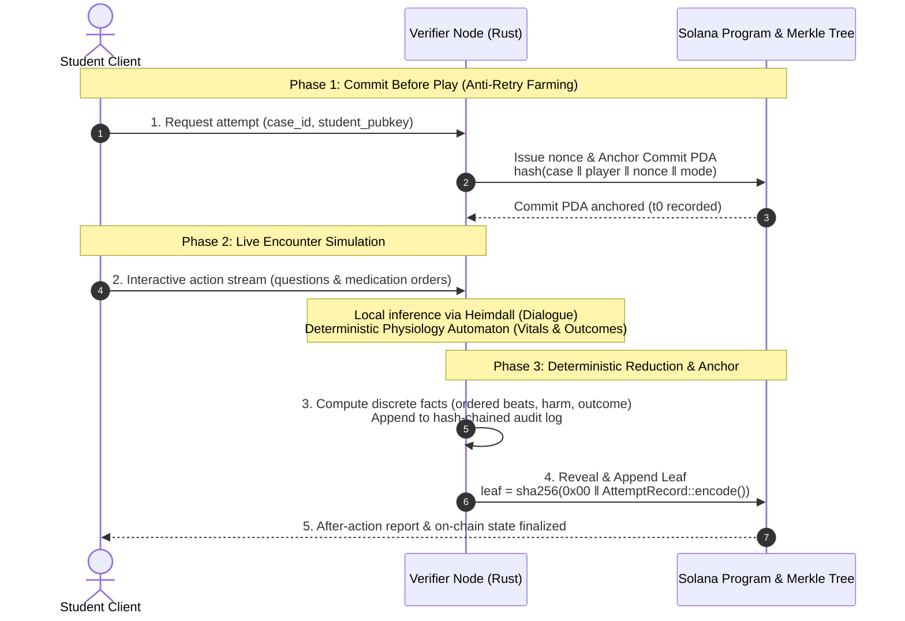
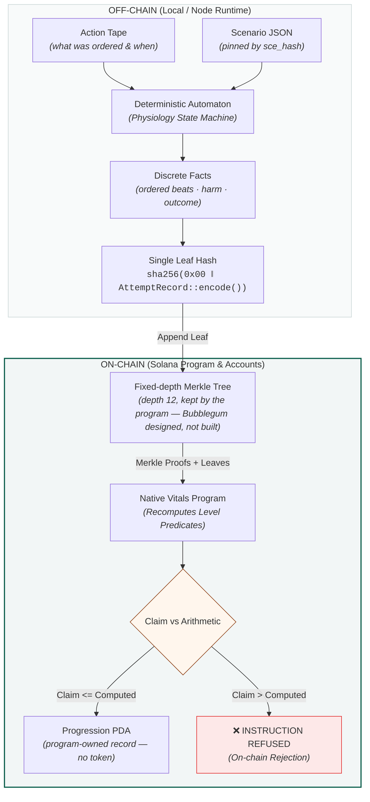
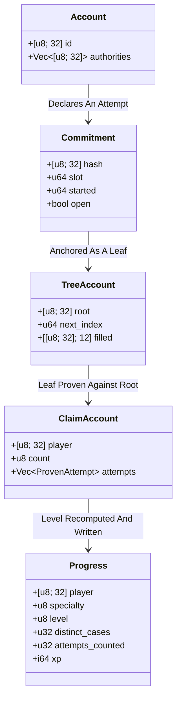
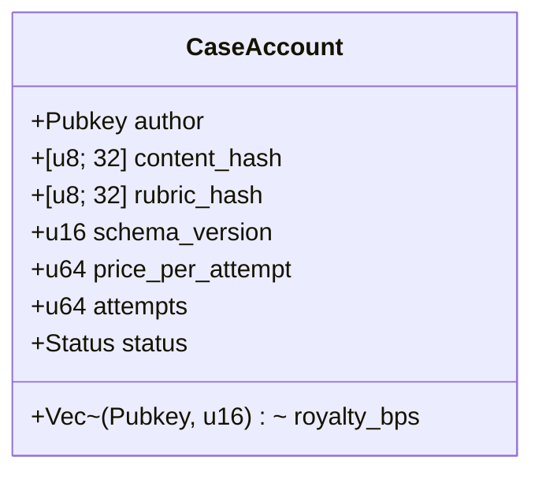
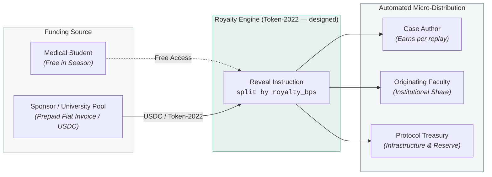

# vitals — Architecture

> **What is running here, and what is a drawing.** This file is the protocol design, and the built
> system departs from it deliberately. Anchoring uses a fixed-depth Merkle tree the program keeps
> itself, not a Bubblegum tree, so a proof is checkable on a laptop with no indexer and no network.
> Progression is a PDA the program writes, not a mint — `crates/vitals-program` contains no mint,
> no token, no cNFT and no Token-2022, and no Anchor either: it is a native `solana-program`
> entrypoint over Borsh, with three dependencies. The Case Registry, the royalty split, the SAS
> credential, achievement badges, the verifier quorum and the `$VIGIL` verification market are all
> designed and not built. Every account type named below is either in
> `crates/vitals-program/src/lib.rs` or carries that label; the design's `CommitAccount`,
> `ProgressionAccount`, `SkillTreeAccount` and `RevealTree` never existed under those names. The
> README's architecture table carries the same split, primitive by primitive.

## 1. Trust model (start here)

The question every judge will ask: *what stops a student from writing themselves a passing grade?*

The student's device signs for itself, but it cannot produce a leaf anyone reads: an anchoring tree is a PDA derived from the *operator's* key, so a run is evidence only relative to whose tree it sits in. A student who funds their own tree anchors into an account no relying party looks at. Three properties follow:

- **Ordering is fixed.** The commit lands before the encounter, so the number of attempts started is public even when only some are revealed. Practising until you get a good run is visible as an attempt count, not hidden as a single lucky record.
- **Scores are re-derivable.** `sce_hash` and `rubric_hash` are pinned in the leaf — the scenario definition and the scorer's inputs, by content rather than by version string. Given the revealed transcript, an independent verifier re-runs the deterministic automaton against those two and must reproduce the same rubric result. A mismatch is a provable dispute, not a subjective disagreement. The design named `engine_ver` and `model_id` alongside them; `AttemptRecord` has no such fields, and its only version byte is `vt02`, the encoding's own tag.
- **Escalation is a parameter — designed, not built.** Low-stakes practice: one verifier, which is what runs. Institutional exam: n-of-m quorum of verifier nodes with all signatures required on the leaf. The program takes one operator's signature today and has no quorum instruction.

> [!NOTE]
> **Honest limit:** this proves the *scoring* was faithful to the transcript. It does not prove the human at the keyboard was the enrolled student. Identity binding is out of scope for the protocol — it is delegated to the issuer (school SSO / proctoring), and the credential carries the issuer's identity so a relying party can judge how much that issuer's proctoring is worth.

---

## 2. End-to-End Verification Pipeline

---

## 3. Onchain accounts

Every type named below is either in `crates/vitals-program/src/lib.rs` or labelled `designed, not
built`. The design once named `CommitAccount`, `ProgressionAccount`, `SkillTreeAccount` and
`RevealTree`; none of those exist under those names, and the built equivalents are the ones drawn
here.

### What the program has

### Account structure details

#### Identity (`Account`)
- **PDA**: `["acct", id]`, where `id` is the first device's public key.
- A person, not a keypair: `authorities` is the list of devices allowed to act as this person, and
  it is never emptied. A second machine is not a second student.

#### Attempt declaration (`Commitment`)
- **PDA**: `["commit", player]`.
- Holds `hash(case ‖ player ‖ nonce ‖ mode)`, the slot it was made at, and `started` — a monotonic
  count of every commitment ever made.
- **Not closed to reclaim rent.** The design said it was; the built account is permanent, because
  the count is the whole mechanism. A refundable commitment would let a learner commit five, play
  five, anchor the good one and erase the rest. `CloseCommitment` moves no lamports; it frees the
  open slot so a new declaration can be made cleanly.

#### Anchoring tree (`TreeAccount`)
- **PDA**: `["tree", operator, tree_id]`.
- A fixed-depth incremental Merkle tree, `DEPTH = 12`, so 4,096 leaves per tree; an operator rolls
  to a new `tree_id` when one fills. Seeded on the operator's key as well as the id, so a foreign
  tree is unaddressable rather than merely unlikely to be hit.
- The design named a Metaplex Bubblegum concurrent Merkle tree, ~$110 per 1M compressed writes.
  That is `designed, not built`: what runs is the tree above, so a proof needs no indexer.

#### Proof buffer (`ClaimAccount` / `ProvenAttempt`)
- **PDA**: `["claim", id, tree_id]`.
- `ProveAttempt` writes one `ProvenAttempt` per transaction, because a Merkle path does not fit in
  a transaction alongside fifteen others. The leaf is kept so a run proven twice cannot count twice.

#### Progression (`Progress`)
- **PDA**: `["prog", id, specialty]` — one record per person per specialty, which is the skill tree.
- `level` is a Dreyfus stage the program **recomputed**, never the stage that was claimed:
  `ClaimProgress` runs `adjudicate` over the proven attempts and returns `ClaimNotEarned` when its
  own arithmetic disagrees.
- **No mint**: the design named a Token-2022 `NonTransferable` mint and a separate
  `SkillTreeAccount`. The built version has neither — the PDA above is the record, so there is
  nothing to transfer.

### Case Registry (a second Solana program — designed, not built)

No account of this shape exists in this repository. It is kept because the design is the argument.

- **PDA**: `["case", author_pubkey, case_slug]`
- Content stays off-chain (encrypted on author's storage or Arweave/IPFS). The chain would hold the
  cryptographic commitment, not the clinical text.

---

## 4. Payment & Micro-Royalty Flow — designed, not built

The program holds no money and moves none. There is no royalty instruction, no splitter and no
Token-2022 account anywhere in `crates/vitals-program`. This section is the design for the layer
that would pay case authors, and the Case Registry above is its other half.

Institutions would **not** need crypto knowledge. A medical school would buy seats in fiat on standard invoices; the platform sponsors gasless fee-payer relays today, and would settle author royalties onchain on their behalf once the instruction exists.

---

## 5. Component Stack Summary

| Component | Role | Stack | Source |
|---|---|---|---|
| `embla-engine` | Encounter simulation + deterministic automaton + audit chain | Rust | Production engine |
| `vitals-program` | Commit/reveal, the anchoring tree, and the on-chain progression predicate. No case registry — that is the row above's other half, `designed, not built` | Rust — native `solana-program` + Borsh. **Not Anchor**: the workspace has no `anchor-lang` dependency, and `Cargo.toml` lists three | **New onchain** |
| `vitals-progress` | Integer arithmetic twin of `xp_for`/`level_for`/`dreyfus`, plus the Merkle tree both sides share (`no_std`) | Rust | **Shared twin** |
| `vitals-replay` | Replays a tape against the physiology automaton and reduces it to anchorable facts | Rust | **New verifier** |
| `vitals-sce` | Independent implementation of the scenario semantics — schema and interpreter | Rust | **New engine** |
| `vitals-osce` | Deterministic OSCE rubric scorer — the re-derivable `det_40` | Rust | **New scorer** |
| `vitals-cli` | Drives the demo against a local validator | Rust | **New tool** |
| `vitals-web` | Playable browser client with fee relayer | HTML5 / Vanilla JS / Rust | **New client** |
| `Heimdall` | Local LLM dialogue gateway (dialogue never touches grade hash) | Local inference | Reused gateway |

---

## 6. Open Questions & Roadmap

- **Tree sizing / rollover:** the built tree is fixed-depth 12 — 4,096 leaves — and an operator rolls to a new `tree_id` when one fills; one tree per cohort-year is the intended unit. Canopy depth is Bubblegum vocabulary and applies to the compressed design, not to this tree.
- **Zero-Knowledge Selective Disclosure (v2):** ZK range proofs to allow students to prove competency (`score >= 80`) without revealing sensitive encounter transcripts.
- **Verifier DePIN Market — designed, not built, and out of scope for this sprint.** The design decentralizes verifier nodes by open staking with `$VIGIL` bonds once verification volume grows. No token exists: there is no mint, no bond account and no slashing instruction anywhere in this repository, and [SPRINT_PLAN.md](SPRINT_PLAN.md) lists verifier-node DePIN with staking and any fungible token among the explicit scope cuts, as v2 lines. [TOKENOMICS.md](TOKENOMICS.md) is that design written out, under the same label.
