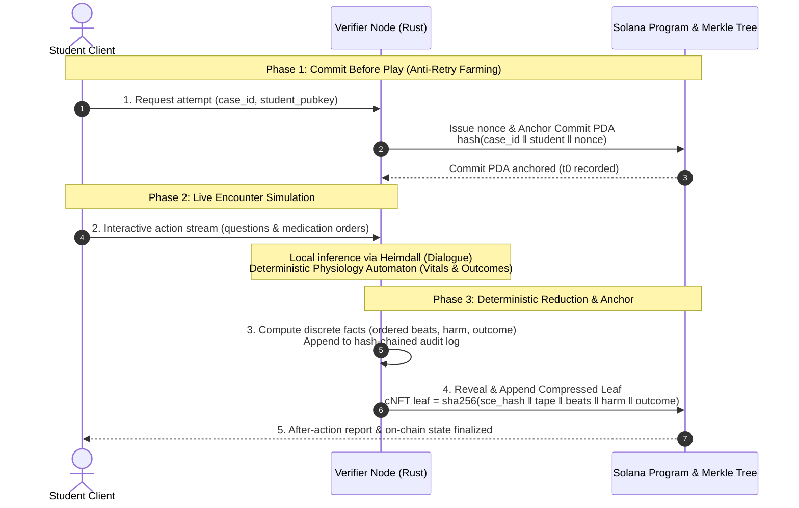
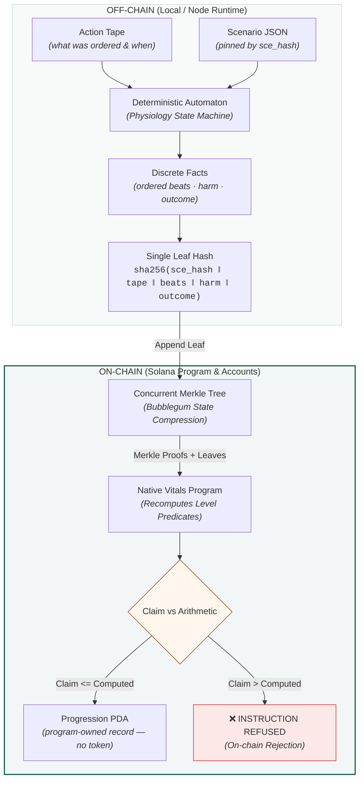
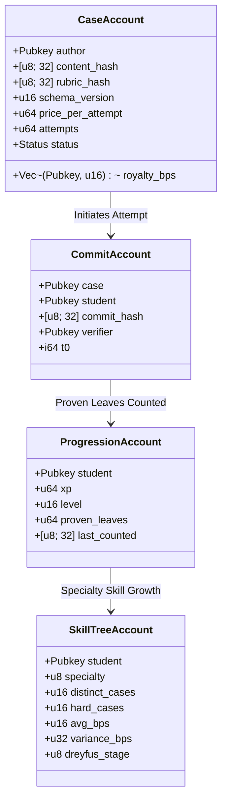

# vitals — Architecture

> **What is running here, and what is a drawing.** This file is the protocol design, and the built
> system departs from it deliberately in three places a reader should know before the first
> diagram. Anchoring uses a fixed-depth Merkle tree the program keeps itself, not a Bubblegum
> tree, so a proof is checkable on a laptop with no indexer and no network. Progression is a PDA
> the program writes, not a mint — `crates/vitals-program` contains no mint, no token, no cNFT and
> no Token-2022, and no Anchor either: it is a native `solana-program` entrypoint. The Case
> Registry, the royalty split and the SAS credential are designed and not built. The README's
> architecture table carries the same split, primitive by primitive.

## 1. Trust model (start here)

The question every judge will ask: *what stops a student from writing themselves a passing grade?*

The student's device never holds a signing key that can produce a valid attestation. The verifier does. Three properties follow:

- **Ordering is fixed.** The commit lands before the encounter, so the number of attempts started is public even when only some are revealed. Practising until you get a good run is visible as an attempt count, not hidden as a single lucky record.
- **Scores are re-derivable.** `engine_ver` and `model_id` are pinned in the leaf. Given the revealed transcript, an independent verifier re-runs the deterministic automaton at that version and must reproduce the same rubric result. A mismatch is a provable dispute, not a subjective disagreement.
- **Escalation is a parameter.** Low-stakes practice: one verifier. Institutional exam: n-of-m quorum of verifier nodes, all signatures required on the leaf.

> [!NOTE]
> **Honest limit:** this proves the *scoring* was faithful to the transcript. It does not prove the human at the keyboard was the enrolled student. Identity binding is out of scope for the protocol — it is delegated to the issuer (school SSO / proctoring), and the credential carries the issuer's identity so a relying party can judge how much that issuer's proctoring is worth.

---

## 2. End-to-End Verification Pipeline

---

## 3. Onchain accounts

### Case Registry (a second Solana program — designed, not built)

### Account Structure Details

#### Case Registry (`CaseAccount`)
- **PDA**: `["case", author_pubkey, case_slug]`
- Content stays off-chain (encrypted on author's storage or Arweave/IPFS). The chain holds the cryptographic commitment, not the clinical text.

#### Attempt Anchor (`CommitAccount` & `RevealTree`)
- **PDA**: `["commit", case_pubkey, student_pubkey, nonce]` (Closed upon reveal to reclaim rent).
- **RevealTree**: designed as a Metaplex Bubblegum concurrent Merkle tree, ~$110 per 1M compressed attempt writes. Built as a fixed-depth tree the program keeps itself, so a proof needs no indexer.

#### Progression Layer (`ProgressionAccount` & `SkillTreeAccount`)
- **PDA**: `["prog", student_pubkey]` & `["skill", student_pubkey, specialty_id]`
- **No mint**: the design named a Token-2022 `NonTransferable` mint. The built version has no token at all — the PDA above is the record, so there is nothing to transfer.
- **Self-Grading Rejection**: `claim_progress` recomputes the level predicate directly from Merkle proofs inside the Solana program runtime.

---

## 4. Payment & Micro-Royalty Flow

Institutions do **not** need crypto knowledge. A medical school buys seats in fiat on standard invoices; the platform sponsors gasless fee-payer relays and settles author royalties onchain on their behalf.

---

## 5. Component Stack Summary

| Component | Role | Stack | Source |
|---|---|---|---|
| `embla-engine` | Encounter simulation + deterministic automaton + audit chain | Rust | Production engine |
| `vitals-program` | Case registry + commit/reveal + on-chain progression predicate | Rust / Anchor | **New onchain** |
| `vitals-progress` | Integer arithmetic twin of `xp_for`/`level_for`/`dreyfus` (no_std) | Rust | **Shared twin** |
| `vitals-cli` | Local testnet validator & verification runner | Rust | **New tool** |
| `vitals-web` | Playable browser client with fee relayer | HTML5 / Vanilla JS / Rust | **New client** |
| `Heimdall` | Local LLM dialogue gateway (dialogue never touches grade hash) | Local inference | Reused gateway |

---

## 6. Open Questions & Roadmap

- **Tree sizing / rollover:** One concurrent tree per cohort-year with canopy depth 14–17.
- **Zero-Knowledge Selective Disclosure (v2):** ZK range proofs to allow students to prove competency (`score >= 80`) without revealing sensitive encounter transcripts.
- **Verifier DePIN Market:** Open staking with `$VIGIL` bonds to decentralize verifier nodes once verification volume grows.
