# vitals — Gamification as onchain progression

> One anchored record, three resolutions. This is the line that keeps the project coherent:
> we are not shipping "credentials **and also** NFTs". We are shipping one verifiable attempt
> record, read at three zoom levels.

| Resolution | Artifact | Stakes | Who can write it | Onchain form, as designed |
|---|---|---|---|---|
| **Attempt** | anchor leaf | raw evidence | verifier | compressed leaf (Bubblegum) — not an NFT, no wallet clutter |
| **Progression** | skill-tree / profile / badge | low, continuous | **anyone, permissionlessly** | soulbound Token-2022 + cNFT |
| **Competency** | credential | high, institutional | accredited issuer | SAS attestation |

> **What of that runs today, before you read any further.** The attempt leaf and the progression
> record. The leaf goes into a fixed-depth Merkle tree the program keeps itself rather than a
> Bubblegum tree, so a proof is checkable with nothing but hashes and no indexer; progression is a
> PDA the program writes rather than a mint. `crates/vitals-program` contains no mint, no token, no
> cNFT and no Token-2022 — grep it. The last column is the design and the rest of this document
> elaborates it; the README's architecture table says which primitives are running and which are
> drawings, and why the built version departs from this one.

## 1. Why the gamification layer is the strongest onchain piece — not the weakest

"Achievement badges as NFTs" is an even older idea than certificate NFTs, and pitched naively it
will actively damage the submission. What rescues it is a fact about the existing code:

**Embla's progression is already a set of pure functions over attempt history.**

```rust
// engine/src/competency.rs — verbatim
pub fn level_for(xp: i64) -> i64 {
    let mut lvl = 1;
    while 25 * (lvl + 1) * (lvl + 2) <= xp { lvl += 1; }
    lvl
}

pub fn dreyfus(avg: f64, distinct: usize, hard: usize, variance: f64) -> &'static str { … }
```

No database lookup, no server opinion, no randomness. `xp_for`, `level_for` and `dreyfus` map a
list of attempts to a level, and they already have unit tests pinning the thresholds.

That means the predicate can live **inside the program** — and does. The program is handed merkle
proofs for a set of anchored attempts, recomputes the level itself, and writes the progression
record only if the claim holds. Nothing is minted; there is no token to mint. There is no trusted
issuer in the progression layer at all.

The distinction that matters to a judge:

> Every other "achievement NFT" is minted **because a server said so**.
> Ours is not minted at all — it is written **because the chain recomputed the predicate and
> agreed**, and refused when it did not.

A program that *computes* rather than *stores* is also the honest answer to
"why does this need Solana" for this layer specifically.

## 2. The three progression artifacts

One of the three runs as a record, one as an identity account, and one is a drawing. Each says
which below, and none of the three is a token.

### Skill tree — one record per specialty, evolving

Not 205 badges cluttering a wallet. **One record per specialty**, whose stage advances through the
Dreyfus stages already implemented:

```mermaid
flowchart LR
    L1["1. Novice<br/><i>(Stage 0)</i>"]
    L2["2. Adv. Beginner<br/><i>(Stage 1)</i>"]
    L3["3. Competent<br/><i>(Stage 2)</i>"]
    L4["4. Proficient<br/><i>(Stage 3)</i>"]
    L5["5. Expert<br/><i>(Stage 4)</i>"]

    L1 -->|Verified Leaves| L2
    L2 -->|Distinct Cases + Accuracy| L3
    L3 -->|Hard Cases + Low Variance| L4
    L4 -->|Mastery Predicate| L5

    style L1 fill:#F8FAFA,stroke:#C9D6D6
    style L2 fill:#E6F1ED,stroke:#0A5E4B
    style L3 fill:#E6F1ED,stroke:#0A5E4B,stroke-width:2px
    style L4 fill:#FFF6ED,stroke:#8E3D11,stroke-width:2px
    style L5 fill:#E6F1ED,stroke:#0A5E4B,stroke-width:3px
```



(with Thai labels from `Dreyfus::as_str_th`, matching Embla's `dreyfus_th`). Art changes at each stage — that is the shareable moment, and
the reason a student cares before any employer does.

**What runs.** A `Progress` PDA at `["prog", id, specialty]`, holding the recomputed Dreyfus stage,
the distinct-case count, the attempt count and XP. `ClaimProgress` is the only writer and it writes
only what `adjudicate` agrees with, so the record cannot advance without the attempts to justify it,
and it advances the moment they exist.

**What is designed, not built.** The token wrapper around that record — Metaplex Core with an
update plugin, or Token-2022 with a metadata pointer, update authority held by the program. There
is no mint, and the useful property was never the token: it was that the program recomputes the
predicate and can refuse.

### Profile — one identity per student

**What runs.** An `Account` PDA at `["acct", id]`, holding the person's id and every device
authorised to act as them. A person, not a keypair: a second machine is not a second student, and
clearing site data is not death. Cumulative XP and level (`level_for`) live in the per-specialty
`Progress` records, which any front-end can read and sum.

**What is designed, not built.** A profile NFT as the identity object — blueprint coverage and
specialties touched carried as token metadata. The PDA above is the record; there is nothing to mint.

### Achievement badges — designed, not built

`Sharp Historian`, `Antibiotic Steward`, `Red-flag Hawk`, `Clean Chart`, `Calm Under Code`
(from Embla's `GAME_DESIGN.md`). Each is a predicate over anchored attempts, and the design mints
them as compressed cNFTs so a badge for every student costs effectively nothing and we never have
to ration them.

**No account holds a badge today.** `Progress` carries a stage, two counts and XP, and nothing
else. The nearest thing that runs is the star tally — `vitals_progress::stars` and `star_tier`,
derived off-chain by the server from proven attempts, gating which episode door opens next. A star
is measured on `det_score`, the re-derivable half, for the same reason a badge with money behind it
would have to be.

### All of it untransferable — deliberately

The design above reached that with the Token-2022 **NonTransferable** extension, no exceptions.
What is built reaches it more cheaply: progression is a PDA the program owns, so there is no token
to transfer in the first place. Either way a tradeable "Expert in Cardiology" badge is credential
fraud with extra steps, and a marketplace for it would be the single fastest way to make this
project worthless.

Worth saying out loud in the pitch: *we are giving up secondary-market volume on purpose.* Judges
have seen a hundred teams reach for tradability because it makes the tokenomics slide easier.
Refusing it, and explaining why, reads as understanding the domain.

## 3. What makes badges more than cosmetics

Three mechanisms, in order of how much they need the chain:

### Badge-gated cases (composability) — designed, not built

Both halves of this are drawings: there is no badge and no registry to hang one on. In the design,
`CaseAccount` — the Case Registry's account, itself `designed, not built` — gains
`required_badge: Option<Pubkey>`, and an author marks a boss case "requires Red-flag Hawk". Any
front-end reading the registry would honour it, because the gate would live in the registry rather
than in our client. That is the composability criterion made concrete: a competing trainer inherits
the gating for free. `UNLOCK.md` carries the same line under the same label.

### Scholarship bounties (the part with real money in it — *coming next*, not built)

**The program holds no money today; that instruction is not written yet.** Everything in this
subsection is the design for it, not a description of something running.

A sponsor — alumni fund, hospital, specialty college, medical school — would fund a bounty:

> "First 100 students to reach Emergency Medicine · Proficient this academic year: ฿5,000 each."

The bounty would pay out on a **provably attained** badge. No committee, no application form, no
trusted distributor, and the sponsor could verify every payout without seeing a single student's
transcript.
Thai medical schools already run scholarship budgets with no good mechanism for skill-based
distribution; this is the mechanism.

This is also the honest answer to "who pays for the chain layer": the sponsor does, and they get
verifiability they cannot currently buy.

### Cohort standing without exposing scores

Rank derived from anchored attempts, so a leaderboard cannot be gamed by a school's own database.
v0.1 ships public-by-opt-in only. The interesting version — proving "top decile" without revealing
the score — is ZK and belongs in v2. Do not promise it in a four-week pitch.

## 4. Anti-farming

Badges with sponsor money behind them would be farmed. The defences are mostly already in the engine:

- **Distinct cases, not attempts.** `dreyfus` requires `distinct >= 3/5/8`; replaying one easy case
  a hundred times moves nothing.
- **Difficulty gates.** Expert requires `hard >= 2`; `xp_for` weights resident 1.6×, intern 1.2×.
- **Consistency gate.** `variance < 144.0` caps Expert — a lucky run inside a noisy history does not
  promote you. Note this already penalises grinding-with-outliers without anyone designing it to.
- **Mode weighting.** `mode == "exam"` earns 1.5×; practice grinding is deliberately inefficient.
- **Commit–reveal exposes the denominator.** The chain knows how many attempts were *started*, so
  a farmed badge carries a visible attempt count next to it. Farming becomes legible rather than
  preventable, which is the more honest goal.

New defence needed before a badge can carry sponsor money: **count first attempts only** for
bounty predicates, and require ranked mode. Add as a flag on the predicate, not a change to `competency.rs`.

## 5. Implementation note — floats do not belong in the program

`dreyfus()` takes `f64` (avg, variance). Porting it into the program meant converting to
fixed-point integers: avg in basis points, variance in basis points squared, thresholds
`5_000/6_500/7_500/8_500` and a consistency cap of `144 * 10_000 = 1_440_000` — upstream's
`variance < 144.0` in the new scale. The Rust engine keeps its `f64` version; the program got an
integer twin, `vitals-progress`.

How the two are held together, stated as it is rather than as it was planned: two unit tests in
`crates/vitals-progress/src/lib.rs` — `dreyfus_matches_upstream_stages`, which mirrors upstream's
`dreyfus_stages()` inputs and expected stages, and `dreyfus_exact_boundaries`, which pins every
threshold at the value either side of it. They are hand-mirrored tests, not a vector file shared
across the two repositories, and nothing fails in this workspace when upstream moves a threshold.
Boundary disagreement between the two implementations is still the most likely silent bug in the
project, and it would show up as students being denied progression they earned.

## 6. Scope — what this cost, and what the sprint says now

This section was the plan written before the layer existed. Keeping the reasoning, and marking what
it turned out to be:

Adding the progression layer was budgeted at roughly **one week of the four**. Something had to
give, and the recommended cut was the SAS competency credential, on the argument that progression
is the better demo — permissionless, recomputable onchain, and visually obvious in a 3-minute
video, whereas an institutional credential needs an institution on stage to mean anything. That
call held: the credential sits in the README's architecture table as `designed, not built`, and it
is named in the sprint's explicit scope cuts rather than promised.

The old weighting read "Week 3 progression program + soulbound mints + bounty demo". The program
and its predicate shipped; the mints never did, and no longer will — there is no token, and
[SPRINT_PLAN.md](SPRINT_PLAN.md) lists **any fungible token** and **tradeable badges, ever** among
the scope cuts. The bounty demo is `designed, not built`; §3 above says so where it is described.
[SPRINT_PLAN.md](SPRINT_PLAN.md) is the current four weeks and this section is not a second plan.
