```mermaid
flowchart LR
    L1["1. Novice<br/><i>(Stage 0)</i>"]
    L2["2. Adv. Beginner<br/><i>(Stage 1)</i>"]
    L3["3. Competent<br/><i>(Stage 2)</i>"]
    L4["4. Proficient<br/><i>(Stage 3)</i>"]
    L5["5. Expert<br/><i>(Stage 4)</i>"]

    L1 -->|Verified Leaves| L2
    L2 -->|Distinct Cases + Accuracy| L3
    L3 -->|Hard Cases + Low Variance| L4
    L4 -->|Mastery Predicate| L5

    style L1 fill:#F8FAFA,stroke:#C9D6D6
    style L2 fill:#E6F1ED,stroke:#0A5E4B
    style L3 fill:#E6F1ED,stroke:#0A5E4B,stroke-width:2px
    style L4 fill:#FFF6ED,stroke:#8E3D11,stroke-width:2px
    style L5 fill:#E6F1ED,stroke:#0A5E4B,stroke-width:3px
```

# vitals — Gamification as onchain progression

> One anchored record, three resolutions. This is the line that keeps the project coherent:
> we are not shipping "credentials **and also** NFTs". We are shipping one verifiable attempt
> record, read at three zoom levels.

| Resolution | Artifact | Stakes | Who can mint | Onchain form |
|---|---|---|---|---|
| **Attempt** | anchor leaf | raw evidence | verifier | compressed leaf (Bubblegum) — not an NFT, no wallet clutter |
| **Progression** | skill-tree / profile / badge | low, continuous | **anyone, permissionlessly** | soulbound Token-2022 + cNFT |
| **Competency** | credential | high, institutional | accredited issuer | SAS attestation |

## 1. Why the gamification layer is the strongest onchain piece — not the weakest

"Achievement badges as NFTs" is an even older idea than certificate NFTs, and pitched naively it
will actively damage the submission. What rescues it is a fact about the existing code:

**Embla's progression is already a set of pure functions over attempt history.**

```rust
// engine/src/competency.rs — verbatim
pub fn level_for(xp: i64) -> i64 {
    let mut lvl = 1;
    while 25 * (lvl + 1) * (lvl + 2) <= xp { lvl += 1; }
    lvl
}

pub fn dreyfus(avg: f64, distinct: usize, hard: usize, variance: f64) -> &'static str { … }
```

No database lookup, no server opinion, no randomness. `xp_for`, `level_for` and `dreyfus` map a
list of attempts to a level, and they already have unit tests pinning the thresholds.

That means the predicate can live **inside the Anchor program**. The program is handed merkle
proofs for a set of anchored attempts, recomputes the level itself, and mints only if the claim
holds. There is no trusted issuer in the progression layer at all.

The distinction that matters to a judge:

> Every other "achievement NFT" is minted **because a server said so**.
> Ours is minted **because the chain recomputed the predicate and agreed**.

A program that *computes* rather than *stores* is also the honest answer to
"why does this need Solana" for this layer specifically.

## 2. The three progression artifacts

### Skill-tree NFT — one per specialty, evolving

Not 205 badges cluttering a wallet. **One token per specialty**, whose metadata advances through
the Dreyfus stages already implemented:



(with Thai labels from `dreyfus_th`). Art changes at each stage — that is the shareable moment, and
the reason a student cares before any employer does.

Mechanism: Metaplex Core with an update plugin, or Token-2022 with a metadata pointer. Update
authority is the program, gated on the recomputed predicate — so the token cannot advance without
the attempts to justify it, and it advances the moment they exist.

### Profile NFT — one per student

Cumulative XP and level (`level_for`), blueprint coverage, specialties touched. The student's
identity object across any front-end built on the registry.

### Achievement badges — compressed, permissionless

`Sharp Historian`, `Antibiotic Steward`, `Red-flag Hawk`, `Clean Chart`, `Calm Under Code`
(from Embla's `GAME_DESIGN.md`). Each is a predicate over anchored attempts. Compressed cNFTs, so
minting a badge for every student costs effectively nothing and we never have to ration them.

### All of it soulbound — deliberately

Token-2022 **NonTransferable** extension, no exceptions. A tradeable "Expert in Cardiology" badge
is credential fraud with extra steps, and a marketplace for it would be the single fastest way to
make this project worthless.

Worth saying out loud in the pitch: *we are giving up secondary-market volume on purpose.* Judges
have seen a hundred teams reach for tradability because it makes the tokenomics slide easier.
Refusing it, and explaining why, reads as understanding the domain.

## 3. What makes badges more than cosmetics

Three mechanisms, in order of how much they need the chain:

### Badge-gated cases (composability)

`CaseAccount` gains `required_badge: Option<Pubkey>`. An author marks a boss case
"requires Red-flag Hawk". Any front-end reading the registry honours it, because the gate is in the
registry rather than in our client. This is the composability criterion made concrete: a competing
trainer inherits the gating for free.

### Scholarship bounties (the part with real money in it — *coming next*, not built)

**The program holds no money today; that instruction is not written yet.** Everything in this
subsection is the design for it, not a description of something running.

A sponsor — alumni fund, hospital, specialty college, medical school — would fund a bounty:

> "First 100 students to reach Emergency Medicine · Proficient this academic year: ฿5,000 each."

The bounty would pay out on a **provably attained** badge. No committee, no application form, no
trusted distributor, and the sponsor could verify every payout without seeing a single student's
transcript.
Thai medical schools already run scholarship budgets with no good mechanism for skill-based
distribution; this is the mechanism.

This is also the honest answer to "who pays for the chain layer": the sponsor does, and they get
verifiability they cannot currently buy.

### Cohort standing without exposing scores

Rank derived from anchored attempts, so a leaderboard cannot be gamed by a school's own database.
v0.1 ships public-by-opt-in only. The interesting version — proving "top decile" without revealing
the score — is ZK and belongs in v2. Do not promise it in a four-week pitch.

## 4. Anti-farming

Badges with sponsor money behind them would be farmed. The defences are mostly already in the engine:

- **Distinct cases, not attempts.** `dreyfus` requires `distinct >= 3/5/8`; replaying one easy case
  a hundred times moves nothing.
- **Difficulty gates.** Expert requires `hard >= 2`; `xp_for` weights resident 1.6×, intern 1.2×.
- **Consistency gate.** `variance < 144.0` caps Expert — a lucky run inside a noisy history does not
  promote you. Note this already penalises grinding-with-outliers without anyone designing it to.
- **Mode weighting.** `mode == "exam"` earns 1.5×; practice grinding is deliberately inefficient.
- **Commit–reveal exposes the denominator.** The chain knows how many attempts were *started*, so
  a farmed badge carries a visible attempt count next to it. Farming becomes legible rather than
  preventable, which is the more honest goal.

New defence needed before a badge can carry sponsor money: **count first attempts only** for
bounty predicates, and require ranked mode. Add as a flag on the predicate, not a change to `competency.rs`.

## 5. Implementation note — floats do not belong in the program

`dreyfus()` takes `f64` (avg, variance). Porting it to an Anchor program means converting to
fixed-point integers: avg in basis points, variance in the same scale, thresholds
`5000/6500/7500/8500` and `14400`. The Rust engine keeps its `f64` version; the program gets an
integer twin, and a shared test vector proves the two agree on every threshold boundary.

Do this as a property test against the existing `dreyfus_stages()` unit test, not by eye. Boundary
disagreement between the two implementations is the most likely silent bug in the whole project,
and it would show up as students being denied badges they earned.

## 6. Scope — what this costs the sprint

Adding the progression layer is roughly **one week of the four**. Something has to give. Recommended
cut: the **SAS competency credential moves to a stub** (schema registered, issuance demoed for one
domain, thresholds not tuned), because progression is the better demo — it is permissionless,
recomputable onchain, and visually obvious in a 3-minute video, whereas an institutional credential
needs an institution on stage to mean anything.

Revised weighting: Week 1 chain skeleton · Week 2 verifier + anchors · **Week 3 progression program
+ soulbound mints + bounty demo** · Week 4 credential stub, polish, submission.
