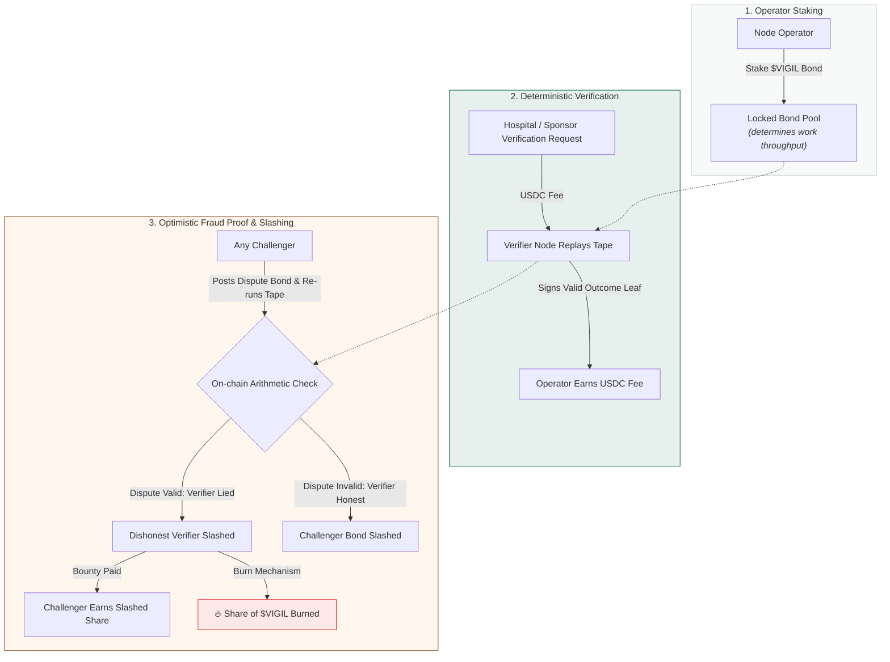
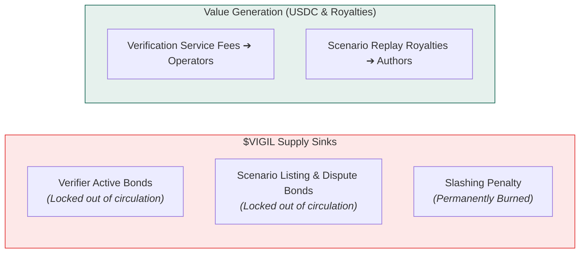
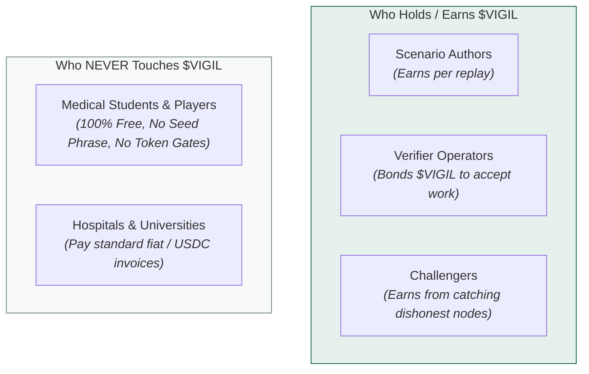

# $VIGIL — the verification market

> The token secures verification. It never represents competence.
> That sentence is the whole design, and the second half is the load-bearing one.

**Why "vigil".** A vigil is kept *beside* the patient, never of the patient — which is exactly where this token sits relative to the credential. Operators keep vigil over a replay; lie about what you saw and your bond is slashed. "Vigilance" has been the motto on the American Society of Anesthesiologists' seal since 1932, under a lighthouse standing for dependable presence, and that is the job description.

**And why the arena has a different name.** The place players compete is **3R** — the emergency room, read back. The leaderboard is the 3R board; the season happens in 3R. Players never hold $VIGIL and never see it, so the two layers do not merely avoid sharing incentives — *they do not share a name.* If you ever find yourself wanting to call the board "the $VIGIL leaderboard", something has gone wrong upstream.

---

## 1. The Verification Market Loop

---

## 2. Why fraud proofs work here and usually don't

Optimistic verification is a well-worn idea that mostly fails, because most disputes are about something fuzzy — was this content acceptable, was this price fair, was this answer good.

Replay is not fuzzy. Given the scenario hash and the tape, the outcome is **exact**. Two honest verifiers cannot disagree.

A dishonest verifier is not caught by a committee. They are caught by arithmetic, by anyone, at any time, forever — because the tape is anchored and the scenario is pinned. **The determinism that makes the credential meaningful is the same property that makes the token enforceable.** Neither half works without the other.

---

## 3. Sinks and sources

| | Flow | Effect on supply |
|---|---|---|
| **sink** | verifier bond, locked while active | out of circulation |
| **sink** | scenario listing bond, dispute bonds | out of circulation |
| **sink** | slashing — a share burned | destroyed |
| **source** | verification fees → operators | earned |
| **source** | replay royalties → scenario authors | earned |

**Who pays:** institutions on ordinary invoices, and sponsors funding outcome-linked scholarships. Fees are denominated in USDC; the token is the bond and the punishment, not the unit of account. A school does not have to hold $VIGIL to use Vitals, and will not.

**Who earns:** node operators and scenario authors — the two parties whose work the network consumes. Weighting distribution toward them rather than toward speculation is the only allocation decision that follows from the design rather than from convention.

**Who pays nothing:** players. Gasless via fee-payer relay, no wallet to fund, no token to hold, no seed phrase to lose. A student who cannot afford anything can still practise and still earn a credential.

---

## 3b. Who actually gets $VIGIL — and who never does

| you are | do you hold $VIGIL? | how |
|---|---|---|
| **a player** | **no, by design** | you never touch it, never see it, never need a wallet |
| a scenario author | yes | earn per replay of a scenario you wrote |
| a verifier operator | yes | stake it to take replay work, earn fees on top |
| a challenger | yes | catch a verifier lying and take their slashed bond |
| an institution or sponsor | mostly no | they pay in USDC on an invoice; the token is bonded on their behalf |

---

## 4. Why credentials are never tokenized

A tradeable "Expert in Cardiology" is credential fraud with extra steps.

Progression tokens in Vitals use Token-2022 **NonTransferable** extensions. They cannot be sold, transferred, or rented. Access to training is open and permissionless. The token secures computation; it never replaces the clinician.
