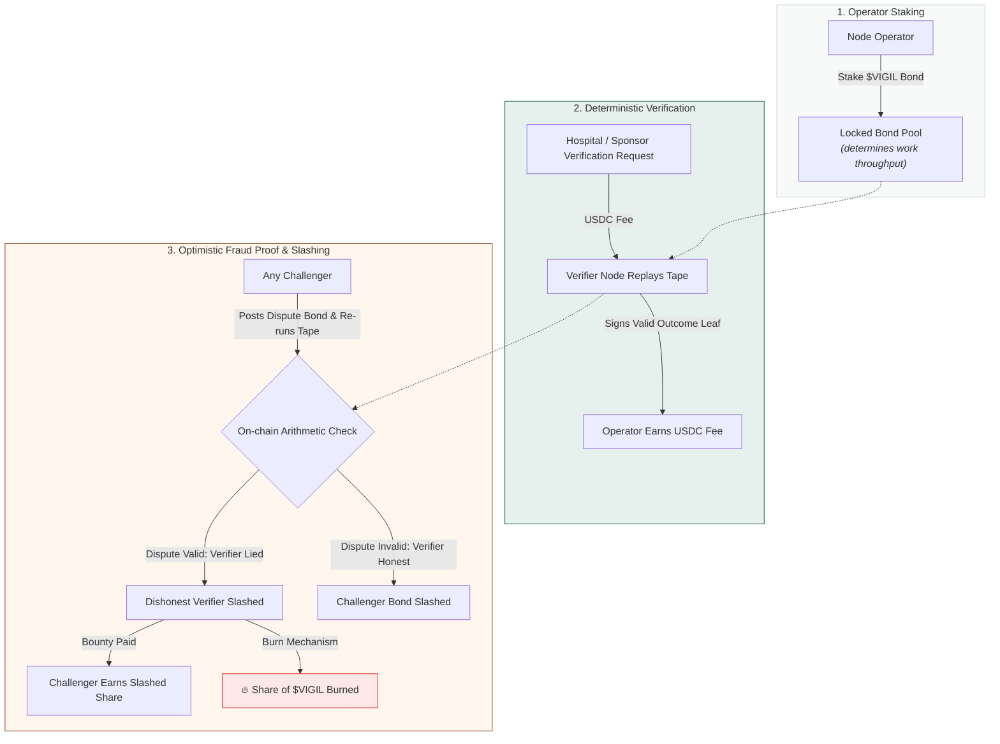
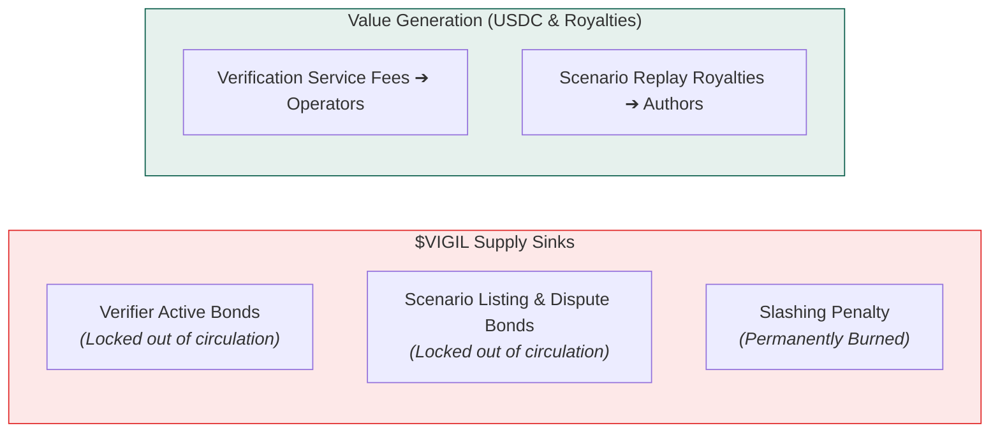
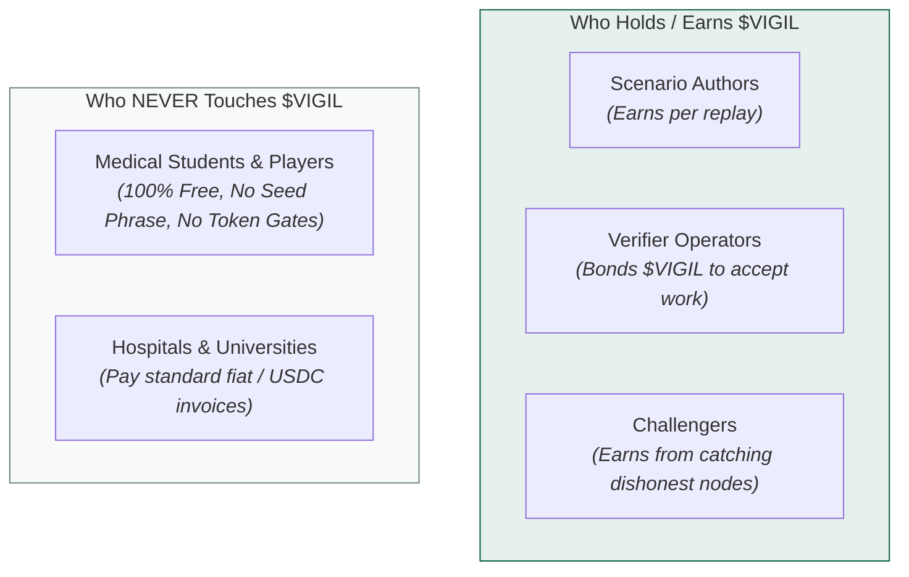

# $VIGIL — the verification market · designed, not built

> **There is no token, and this document is why there is a document about one.**
> No mint, no bond account, no staking instruction and no slashing instruction exists in this
> repository — `crates/vitals-program` has three dependencies and none of them is a token program.
> [SPRINT_PLAN.md](SPRINT_PLAN.md) lists verifier-node DePIN with staking and **any fungible token**
> among the explicit scope cuts, as v2 lines. Every present tense below is the design's, not the
> program's.
>
> **Why this file survives the sweep that took the token out of the README.** A refusal you cannot
> inspect is not a refusal. The README, [ARCHITECTURE.md](ARCHITECTURE.md) and
> [GAMIFICATION.md](GAMIFICATION.md) all now say *no token* in several places; delete this and the
> thing being refused exists nowhere, so a reader can see the denial and never the design it
> denies. A project that quietly deletes its tokenomics page has done the easier half of this.

> The token would secure verification. It would never represent competence.
> That sentence is the whole design, and the second half is the load-bearing one.

**Why "vigil".** A vigil is kept *beside* the patient, never of the patient — which is exactly where this token would sit relative to the credential. Operators would keep vigil over a replay; lie about what you saw and your bond is slashed. "Vigilance" has been the motto on the American Society of Anesthesiologists' seal since 1932, under a lighthouse standing for dependable presence, and that is the job description.

**And why the arena has a different name.** The place players compete is **3R** — the emergency room, read back. The leaderboard would be the 3R board; the season would happen in 3R. That name is a drawing too — it appears in this document, `PLAY.md` and `UNLOCK.md`, and nowhere in `crates/` or `demo/`. Players would never hold $VIGIL and never see it, so the two layers do not merely avoid sharing incentives — *they do not share a name.* If you ever find yourself wanting to call the board "the $VIGIL leaderboard", something has gone wrong upstream.

---

## 1. The Verification Market Loop

None of the following runs. Read every arrow as a drawing.

---

## 2. Why fraud proofs work here and usually don't

Optimistic verification is a well-worn idea that mostly fails, because most disputes are about something fuzzy — was this content acceptable, was this price fair, was this answer good.

Replay is not fuzzy. Given the scenario hash and the tape, the outcome is **exact**. Two honest verifiers cannot disagree.

A dishonest verifier would not be caught by a committee. They would be caught by arithmetic, by anyone, at any time, forever — because the tape is anchored and the scenario is pinned, and *those two are built*. **The determinism that makes the credential meaningful is the same property that would make the token enforceable.** Neither half works without the other, which is why the determinism came first and the token has not come at all.

---

## 3. Sinks and sources

Of a supply that does not exist. No mint, so no circulation, so nothing is locked or burned.

| | Flow | Effect on supply |
|---|---|---|
| **sink** | verifier bond, locked while active | out of circulation |
| **sink** | scenario listing bond, dispute bonds | out of circulation |
| **sink** | slashing — a share burned | destroyed |
| **source** | verification fees → operators | earned |
| **source** | replay royalties → scenario authors | earned |

**Who would pay:** institutions on ordinary invoices, and sponsors funding outcome-linked scholarships. Fees would be denominated in USDC; the token is the bond and the punishment, never the unit of account. A school would not have to hold $VIGIL to use Vitals, and would not. Today it pays nothing on chain at all — the program holds no money and moves none.

**Who would earn:** node operators and scenario authors — the two parties whose work the network consumes. Weighting distribution toward them rather than toward speculation is the only allocation decision that follows from the design rather than from convention. The layer that would pay a scenario author is the Case Registry, which is `designed, not built` for a reason that is not technical: who pays for a case is an open question, and three plausible payers give three different protocols.

**Who pays nothing:** players — and this half is built. Gasless via fee-payer relay, no wallet to fund, no token to hold, no seed phrase to lose. A student who cannot afford anything can still practise today.

---

## 3b. Who would get $VIGIL — and who never would

Nobody holds $VIGIL, because it does not exist. This is the allocation the design would have.

| you are | would you hold $VIGIL? | how |
|---|---|---|
| **a player** | **no, by design** | you never touch it, never see it, never need a wallet |
| a scenario author | yes | earn per replay of a scenario you wrote |
| a verifier operator | yes | stake it to take replay work, earn fees on top |
| a challenger | yes | catch a verifier lying and take their slashed bond |
| an institution or sponsor | mostly no | they pay in USDC on an invoice; the token is bonded on their behalf |

---

## 4. Why credentials are never tokenized

A tradeable "Expert in Cardiology" is credential fraud with extra steps. This section is not a
drawing: it is the decision that governs the built system, and it is the reason the rest of this
file stays a drawing.

Progression in Vitals is not a token at all: the program writes a `Progress` PDA it owns, so there is nothing to sell, transfer or rent, and no instruction moves one. The design that named a token used Token-2022 **NonTransferable** extensions to reach the same end; the built version reaches it by having no token. [SPRINT_PLAN.md](SPRINT_PLAN.md) puts **tradeable badges, ever** in the scope cuts and marks it a design decision rather than a deferral. Access to training is open and permissionless. The token would secure computation; it would never replace the clinician, and it is not what the credential is made of.
