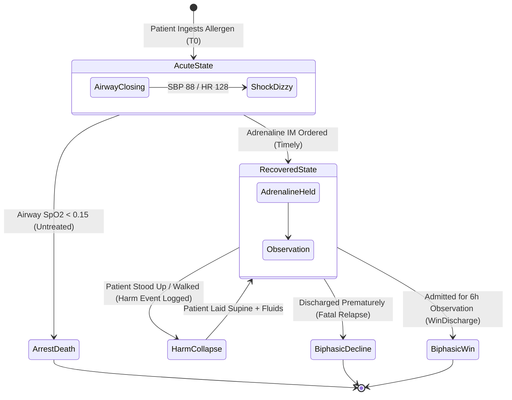
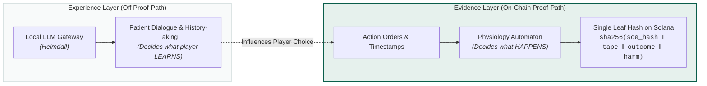

# The world model — and why it solves the problem the rubric couldn't

> This supersedes the "40 proven / 60 attested" compromise in [RISKS.md](RISKS.md) §3.
> The rubric was never the right thing to anchor. The world model is.

---

## 1. Clinical State Machine Transition Model



---

## 2. What Embla already runs

`engine/src/sce_runtime.rs` is a **data-driven hybrid automaton** — a physiology engine loaded from JSON, not hardcoded:

- continuous per-second **vital dynamics** inside the current state (`hr, sbp, dbp, spo2, rr, temp, gcs`, plus declared custom axes)
- global **triggers**
- discrete **state transitions**
- free-text **interventions**
- emitted **narrative beats**, accumulated **harm events**, and a terminal **outcome**

Its API is two calls:

```rust
SceState::tick(&mut self, dt: f64) -> Vec<NarrativeBeat>
SceState::apply(&mut self, action: &Action) -> Vec<NarrativeBeat>
```

And its own golden tests already drive it with a replay tape:

```rust
enum Step { Tick(f64), Do(Action) }
```

That enum is the format. The test harness for the physiology engine is, without anyone intending it, an **encounter replay format**.

---

## 3. The LLM vs Automaton Split



| Part | Nature | In the proof path? |
|---|---|---|
| The patient's dialogue | LLM roleplay, non-deterministic | **No** |
| The world model — vitals, transitions, harm, outcome | deterministic automaton | **Yes** |

Score the player on **what they did to the world**, not on how well they chatted. Then:

```
leaf = hash(sce_id ‖ sce_hash ‖ action_trace ‖ outcome ‖ harm_events ‖ beats)
```

A verifier loads the same SCE JSON, replays the same tape, and must reach the same outcome. **No LLM anywhere in the verification path.**
